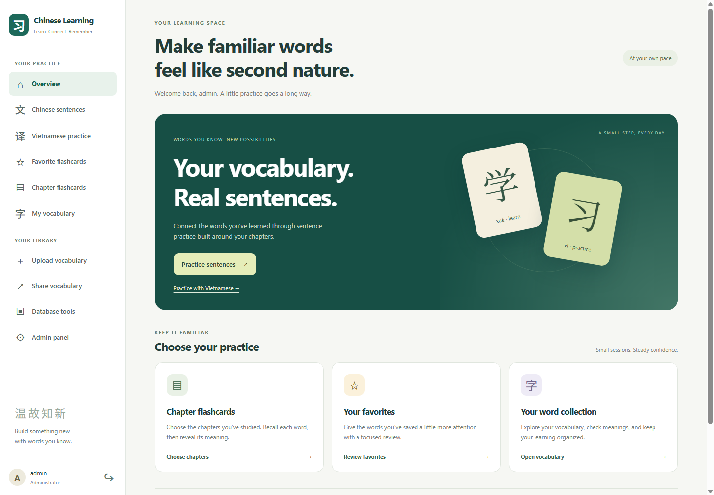
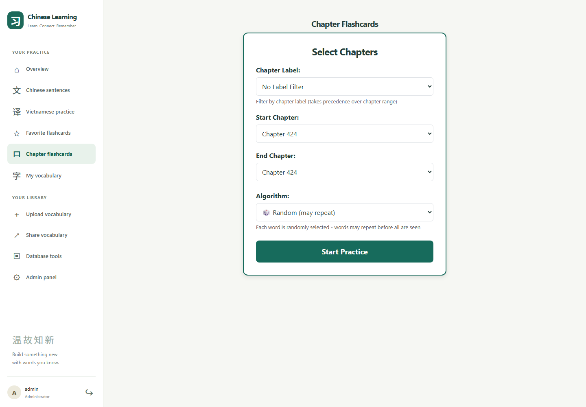

# Chinese Learning App

**Practice Chinese sentences with the vocabulary you already know.**

For Chinese learners who feel overwhelmed by unfamiliar words, this app helps them practice sentences confidently **by building practice around vocabulary they have already learned**.

## The gap this app solves

Knowing individual words does not always make it easy to understand or form a sentence. Practice materials can introduce too many unfamiliar words at once, turning a sentence exercise into a series of dictionary lookups.

Chinese Learning App starts with your own vocabulary list and the chapters you have studied. The goal is to make it easier to use familiar words in new combinations, build sentence comprehension, and practice without feeling overwhelmed.

## See the app

| Learning home | Chapter flashcards |
| --- | --- |
|  |  |

These captures show the desktop web app. The layout also adapts to phone screens. For a quick overview of the learning flow, see the [product brochure](docs/brochure/chinese-learning-brochure.pdf) or its [PNG preview](docs/brochure/chinese-learning-brochure.png).

## How it works

1. **Add the words you have learned.** Upload or manage your vocabulary and organize it by chapter.
2. **Choose your practice scope.** Use chapter-based vocabulary groups to match your current learning progress.
3. **Practice sentences built around those words.** Read Chinese phrases, listen to pronunciation, and use pinyin and meanings for support.
4. **Review and expand.** Save favorite words, practice flashcards, and add new chapters as you learn more.

For example, if you have studied chapters 1–3, you can practice with a vocabulary group covering those chapters before moving on to later material.

## Features

| Feature | How it helps you learn |
| --- | --- |
| Personal vocabulary library | Keep your practice connected to the words you have studied, with Chinese characters, pinyin, meanings, and learning notes. |
| Vocabulary upload and chapter organization | Bring in your learning material and organize it around your course or study plan. |
| AI-generated Chinese sentences | Practice familiar vocabulary in sentence contexts and new combinations. |
| Chapter-based practice groups | Match sentence practice to your current vocabulary scope. |
| Chinese and Vietnamese phrase practice | Practice comprehension and translation with Vietnamese language support. |
| Pronunciation playback | Hear words and sentences while reviewing their written forms. |
| Pinyin, Vietnamese, and English meanings | Get support when you need help reading or understanding a phrase. |
| Favorite-word and chapter flashcards | Review words you want to reinforce or focus on a particular chapter. |
| Vocabulary sharing | Share study vocabulary with other learners. |
| Parent and child accounts | Let children practice with vocabulary managed through a linked parent account. |

Sentence generation uses the selected vocabulary and a small set of basic grammatical particles. AI-generated output can vary; the app is designed to keep practice within your learning scope, rather than guarantee that every generated sentence contains only words you have explicitly added.

## Flashcards: recall the words you have learned

Sentence practice builds on word recall. Flashcards let you review your own vocabulary before using it in sentences, without introducing a separate, unfamiliar word list.

- **Chapter decks:** choose a chapter range or chapter label to match the material you have studied.
- **Favorite decks:** review saved words, with chapter filters for a more focused session.
- **Recall before revealing:** see the Chinese characters first, then reveal pinyin, available Vietnamese and English meanings, and your learning notes. Hide the answer to try again.
- **Listen while reviewing:** play Chinese pronunciation using your browser's speech synthesis; voice availability depends on your device.
- **Choose your order:** use random selection for quick practice, or shuffled mode to work through the selected deck before it reshuffles.
- **Keep your library useful:** favorite words and edit vocabulary details where your account permissions allow. Child accounts use their linked parent's vocabulary and have editing restrictions.
- **Comfortable on phone and desktop:** grouped Listen, Reveal, and Next controls keep the main study actions together; mobile navigation keeps common destinations within reach.

Flashcards support self-directed review; they do not currently schedule spaced repetition or score mastery.

## Who it is for

- Learners who know some Chinese words but need more practice using them in sentences.
- Learners following a textbook or chapter-based course who want exercises aligned with their progress.
- Vietnamese-speaking learners who benefit from Vietnamese meanings and translation practice.
- Parents supporting a child's Chinese vocabulary practice.

## Project structure

- `packages/frontend` — React and TypeScript web app.
- `packages/backend` — Express and TypeScript API with MySQL storage and AI generation services.
- `packages/ios-app` — Expo and React Native mobile app source.

The web app provides the main learning and administration interface. Mobile functionality may differ from the web app.

## Run locally

1. Install Node.js and MySQL, then run `npm install` from the repository root.
2. Copy `packages/backend/.env.example` to `packages/backend/.env`. Configure your database connection, API keys, and a strong random `JWT_SECRET`.
3. Create the database using `packages/backend/database/setup.sql` and configure an admin account using `packages/backend/scripts/setup-admin-user.ts`.
4. Run `npm run dev:backend` and `npm run dev:frontend` in separate terminals.
5. Open **http://localhost:5173**.

Administration tools include account management and database backup and restore. Developers can also enable the optional [temporary admin testing entry](TEMP_ADMIN_ACCESS.md), which is disabled by default.

Keep credentials in local environment files. Deployment configuration and private server details are not included in this repository.
